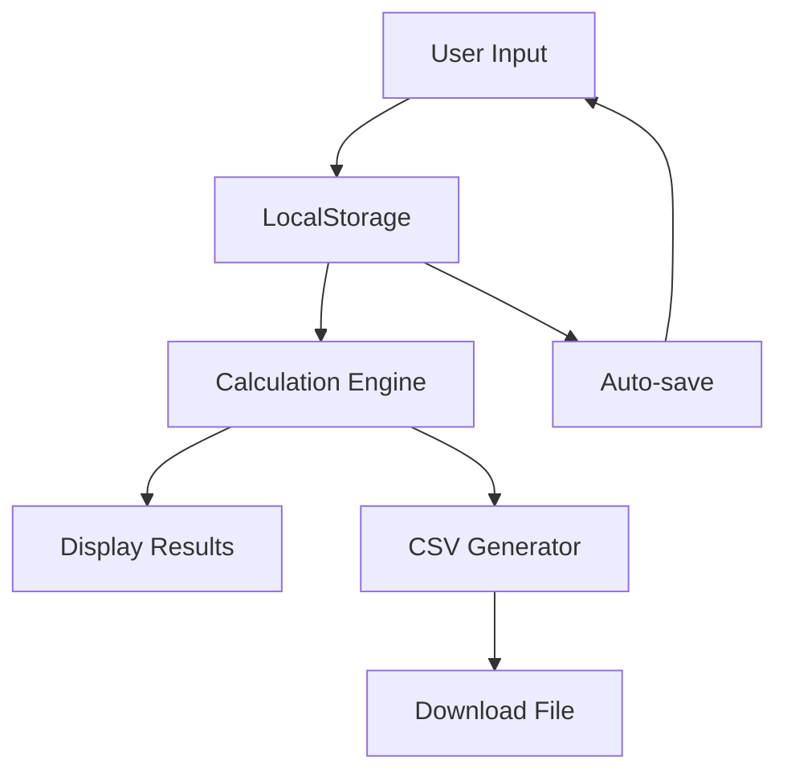

---

📋 Project Overview

SCOR·POINT is a professional-grade web application designed to automate score calculation for scrims, tournaments, and competitive matches. Built to eliminate manual calculation errors and streamline event management.

Live Demo: [Coming Soon]
Version: 2.0.0 Professional
Release Date: Q2 2025
Developer: Momonpxl Development Team

---

🎯 Value Proposition

Problem Solution
Manual calculation errors ✅ Automated scoring system
Disputes over score accuracy ✅ Transparent calculation logic
Time-consuming data entry ✅ Bulk input & CSV export
Inconsistent scoring rules ✅ Fully customizable point system
Branding limitations ✅ Complete event identity customization

---

✨ Key Features

🏷️ Event Management

Feature Description
Custom Event Organizer Display your organization's name prominently
Event Status Scrim, Tournament, Fun Match, or Custom
Event Name Unique identifier for each competition
Creator Attribution Transparent ownership and accountability

⚙️ Scoring Engine

Feature Description
Placement Points (#1-15) Fully customizable per position
Kill Points Adjustable value per elimination (default: 1)
Real-time Calculation Instant results as you input data
Auto-ranking Automatic sorting by total score

🧑‍🤝‍🧑 Team Management

Feature Description
Dynamic Team Roster Add/remove teams on the fly
Unlimited Teams No hard-coded limits
Team Renaming Edit team names anytime
Minimum 1 Team Safe handling of edge cases

🎮 Match Configuration

Feature Description
Custom Match Count 1 to unlimited matches
Per-Match Input Position & kills for each team
Data Persistence Local storage saves your progress
Input Validation Prevents invalid data entry

📊 Export & Reporting

Feature Description
CSV Export Complete data export in universal format
Final Rankings Sorted leaderboard with total points/kills
Match Details Per-match breakdown for each team
Event Metadata Includes organizer, date, and settings

---

🖥️ Technical Specifications

Technology Stack

```yaml
Frontend: HTML5, CSS3, JavaScript (Vanilla)
Storage: Browser LocalStorage
Export Format: CSV (UTF-8)
Compatibility: Chrome, Firefox, Safari, Edge
Responsive: Mobile-friendly interface
```

System Requirements

· Any modern web browser
· JavaScript enabled
· No server/database required
· No installation needed

---

📦 Installation & Setup

Option 1: Direct Use

```bash
# No installation required
# Open index.html in any browser
# Start calculating immediately
```

Option 2: Self-Hosting

```bash
# Clone repository
git clone https://github.com/momonpxl/scor-point.git

# Navigate to directory
cd scor-point

# Open with live server or directly
open index.html
```

Option 3: Integration

```html
<!-- Embed in your existing website -->
<iframe src="scor-point/index.html" width="100%" height="800px"></iframe>
```

---

📖 User Guide

Quick Start

1. Set Event Details – Name, date, organizer, creator
2. Configure Points – Adjust placement values and kill points
3. Add Teams – Input participating team names
4. Set Match Count – Number of matches to play
5. Enter Results – Position and kills per match
6. Calculate – Click "HITUNG SCOR" for instant results
7. Export – Download CSV for record keeping

Advanced Features

· Auto-save – All inputs are saved locally
· Reset Defaults – One-click restore of default point values
· Live Preview – Results update with animation
· Error Handling – Clear messages for missing data

---

📊 Output Examples

CSV Export Structure

```csv
# SCOR POINT EXPORT - WEEKLY SCRIM
# Date: 2025-04-10 | Organizer: SANN404 | Creator: OPERATOR
# Point settings: #1=15 #2=13 #3=10 #4=8 #5=6 #6=4 #7-10=2 #11-15=1 | Kill = 1
# Teams: Team Alpha, Team Beta, Team Gamma
# Matches: 2
# 
FINAL RANKING
Rank,Team,Total Points,Total Kills
1,"Team Beta",87,12
2,"Team Alpha",76,8
3,"Team Gamma",54,6

MATCH DETAILS
Team,Match 1 Position,Match 1 Kills,Match 2 Position,Match 2 Kills
"Team Alpha",2,5,1,3
"Team Beta",1,7,2,5
"Team Gamma",3,2,3,4
```

Sample Calculation

```javascript
// Example: Match 1
Team Alpha: Position #2 (13 pts) + 5 kills = 18 points
Team Beta:  Position #1 (15 pts) + 7 kills = 22 points
Team Gamma: Position #3 (10 pts) + 2 kills = 12 points
```

---

🔧 Configuration Reference

Default Point Settings

Position Default Points Custom Range
#1 15 0-999
#2 13 0-999
#3 10 0-999
#4 8 0-999
#5 6 0-999
#6 4 0-999
#7-10 2 0-999
#11-15 1 0-999
Kill Value 1 0-999

Data Persistence

· Storage Key: scorData
· Match Data: match_[match#]_team_[team#]
· Retention: Unlimited (browser-dependent)
· Clear Data: Clear browser storage or overwrite

---

🛡️ Security & Privacy

Aspect Implementation
Data Storage Local browser only
Network No data transmission
Third-party No external scripts
Export User-initiated download
Cookies None used

---

🚀 Performance

Metric Performance
Load Time < 1 second
Calculation < 100ms
CSV Export < 50ms
Memory Usage < 10MB
Bundle Size ~25KB (minified)

---

👥 Credits & Acknowledgments

Core Team

Role Name Contact
Creator & Lead Developer Momonpxl t.me/momonpxl
UI/UX Designer Admin GoostTeam https://t.me/PIDtxB2fkWw5ZWQ1
Product Advisor Tytialo -

Special Thanks

· GoostTeam Community – Testing and feedback
· Early Adopters – First 100 users
· Open Source Contributors – Fonts and inspiration

Connect With Us

· 📱 Telegram: t.me/momonpxl
· 🎵 TikTok: @momonpxl
· 📸 Instagram: @momonpxl
· 💻 GitHub: github.com/momonpxl

---

📄 License & Usage

Copyright

© 2025 Momonpxl. All Rights Reserved.

Permitted Use

· ✅ Personal scrims and tournaments
· ✅ Educational purposes
· ✅ Non-commercial events
· ✅ Modification for personal use

Prohibited Use

· ❌ Commercial redistribution
· ❌ Removal of credits
· ❌ Claiming as your own work
· ❌ Selling as a service without permission

Attribution Required

When sharing or showcasing, please include:

```
Created by Momonpxl (t.me/momonpxl)
```

---

🔄 Version History

Version 2.0.0 (Current) – Professional Edition

· ✅ Complete UI overhaul
· ✅ Enhanced CSV export
· ✅ Real-time calculation
· ✅ Auto-save functionality
· ✅ Mobile responsive design

Version 1.2 – CSV Edition

· ✅ CSV export feature
· ✅ Match details export
· ✅ Point customization

Version 1.0 – Basic Edition

· ✅ Core scoring engine
· ✅ Team management
· ✅ Basic UI

---

📞 Support & Contact

Technical Support

· Documentation: This README
· Issues: GitHub Issues (if applicable)
· Direct: Telegram @momonpxl

Feature Requests

Have an idea? Contact via:

· Telegram with hashtag #SCORPOINT
· Direct message on Instagram/TikTok
· Include detailed description

Bug Reports

Please provide:

· Browser and version
· Steps to reproduce
· Expected vs actual behavior
· Screenshots if applicable

---

🎯 Roadmap 2025-2026

Quarter Planned Features
Q3 2025 Multi-language support
Q4 2025 Print-friendly reports
Q1 2026 PDF export option
Q2 2026 Cloud sync (optional)
Q3 2026 Tournament bracket view
Q4 2026 API integration

---

⚡ Quick Start (Cheat Sheet)

```bash
1. Open index.html
2. Fill event details
3. Add teams (min 1)
4. Set matches count
5. Input positions & kills
6. Click "HITUNG SCOR"
7. Click "EXPORT CSV"
8. Share results
```

---

🏆 Why Choose SCOR·POINT?

Aspect SCOR·POINT Manual Calculation
Accuracy 100% Error-prone
Speed 2 seconds 10+ minutes
Transparency Full audit trail Subjective
Customization Complete Limited
Record Keeping CSV export Paper/notes
Cost Free Time & frustration

---

🤝 Contributing

While this is a personal project, feedback is welcome:

1. Test – Use in your scrims
2. Feedback – Share your experience
3. Suggest – Propose improvements
4. Share – Spread the word

---

💬 Testimonials

"Finally, no more arguments about scores!"
— Tytialo, Early Tester

"The CSV export saves me hours of spreadsheet work."
— Admin GoostTeam, Designer

"Custom point system is perfect for our unique rules."
— Anonymous, Tournament Organizer

---

🎨 Design Philosophy

· Clarity over complexity – Every element serves a purpose
· Speed over flash – Fast interactions, minimal waiting
· Transparency – See exactly how scores are calculated
· Flexibility – Adapt to any competition format
· Accessibility – Works on phones, tablets, desktops

---

📊 Technical Architecture



---

🔍 Keywords

scrim calculator tournament score esports scoring match points competitive gaming score tracker tournament organizer scrim tool point system csv export free scoring app momonpxl scor point scrim master

---

📌 Footer

SCOR·POINT Professional Edition
Automate. Calculate. Dominate.

---

Created with ❤️ by Momonpxl
© 2025 – All rights reserved

---

Last Updated: February 2026
